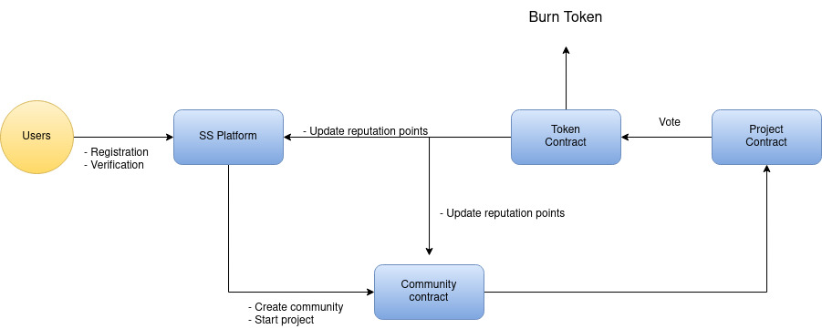

# Social Score Platform

The Social Score Platform is a decentralized reputation system built on the Ethereum blockchain. It provides a way to rate and evaluate individuals' behavior within different communities and projects. This platform aims to encourage positive contributions and foster a sense of accountability among participants.

## Getting Started

To deploy and interact with the Social Score Platform, follow these steps:

1. Clone the repository: 
```
git clone https://github.com/akashvaghela09/social-score.git
```
2. Install the necessary dependencies: 
```
npm install --save-dev hardhat
```

## Smart Contracts

The Social Score Platform is composed of the following smart contracts:

- **SocialScore**: The main contract that handles user registration, community management, and overall reputation tracking.
- **Community**: Contract for managing individual communities, allowing the creation of projects and the addition of participants.
- **Project**: Contract for tracking project-related metadata, voting on participants, and managing reputation points.

## Usage

The Social Score Platform provides the following functionalities:

- User Registration: Users can create their accounts and receive a Social Score Token (SBT) as a unique identity.
- Community Management: People or organizations can create and manage their own communities, add members, and start projects.
- Project Creation: Community admins can create projects within their communities, specifying a title and associated metadata.
- Voting: Participants can upvote or downvote other users' contributions in projects, influencing their reputation points.
- Reputation Points: Each user's reputation points reflect their overall standing within the community and projects.

## Flow Diagram
Here is a high-level flow diagram illustrating the key processes in the Social Score Platform:



## License

This project is licensed under the [MIT License](LICENSE).
